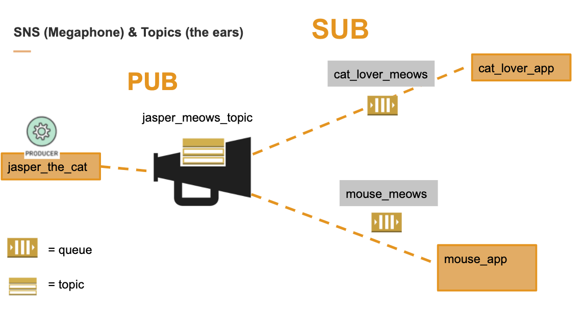

# sns-sqs-fun
Project that helps you learn the ins an out of sns and sqs

# Set Up AWS ClI for your AWS account if you have not done so before

1. First set up your your AWS CLI by following the getting started [guide](https://docs.aws.amazon.com/comprehend/latest/dg/getting-started.html)
1. You can confirm your set up by typing `aws help` and confirm you get something back
1. Set up a new user for your AWS account by going [here](https://console.aws.amazon.com/iam/home)
   1. Give the user Programmatic Access
   1. Download the `aws_access_key_id` and your `aws_secret_access_key` for your new user
   1. Give the user the right permissions by giving them these poilicies: AmazonSQSFullAccess, AmazonSNSFullAccess
1. Add a new profile to your aws credentials by following directions [here](https://docs.aws.amazon.com/cli/latest/userguide/cli-configure-profiles.html)

# Now get the gems you need

1. run `bundle`

# SNS/SQS Not so great diagram

# SNS Topic Setup

1. Sign into your AWS console with your personal aws account [here](https://aws.amazon.com/console/)
1. Go to create your new topic [here](https://us-west-2.console.aws.amazon.com/sns/v3/home)
   1. Give it a name and play around read the options but you can just create them with the default
      options
   1. Make sure you copy the ARN (Amazon Resource Number) for your topic

# Publishing to your Topic

1. Go in the topic_publisher.rb script set your `AWS_CREDENTIALS_PROFILE` constant to the name of your
personal aws profile that references your personal aws account user credentials that has permissions to publish to access SNS
and SQS. You can run this command in your terminal `cat ~/.aws/config` to get the profile.
1. Go in and edit the topic_publisher.rb script by setting the `TOPIC_ARN` constant with the
 topic ARN  that you copied from the above steps
1. Now let's play with publishing with the queue by running the topic_publisher script `ruby
topic_publisher.rb` (There is a pry in there so you can just run it yourself and see the response)
1. Once in the pry you can run the following command: `response = client.publish(test_message)`
1. Do you get a response?

# SQS Queue Setup

1. Go to create your new Queue [here](https://console.aws.amazon.com/sqs)
1. Pick for now the Standard Queue and give it a name and pick the `Quick-Create Queue` option
1. Now we need to subscribe the queue to a topic so it starts listening to our megaphone
1. Click on your queue and select `Queue Actions` button and pick the the `Subscribe Queue to
SNS Topic` option
1. Now you can click on your Queue and at the bottom click on the `Permissions` tab and you should
see that you have given the topic you subscribed to permission for this queue
1. Now go copy down the queue url listed for the queue for the steps below

# Consuming from your Queue

1. Go in the queue_subscriber.rb script set your `AWS_CREDENTIALS_PROFILE` constant to the name of your
personal aws profile that references your personal aws account user credentials that has permissions to publish to access SNS
and SQS. You can run this command in your terminal `cat ~/.aws/config` to get the profile.
1. Go in and edit the queue_subscriber.rb script by setting the `QUEUE_URL` constant with the
 queue url that you copied from the above steps
1. Now let's play with publishing with the queue by running the topic_publisher script `ruby
queue_subscriber.rb` (There is a pry in there so you can just run it and then start playing with
commands in there)
1. Once in the pry you can run the following command: `response = client.receive_message(queue_subscriber_request)` or just go step through the pry with `next`
1. Do you get a response with some messages? Explore the response? What are in the messages?
1. If you want to play with this even more run the script at the same time another terminal and
after creatiging a new queue that subscribes to your topic, try pulling the same message down
from the two different queues

# More Help
 1. [7 minute youtube video on how to setup topic and queue](https://www.youtube.com/watch?v=VXsAgYoC1Jc)
